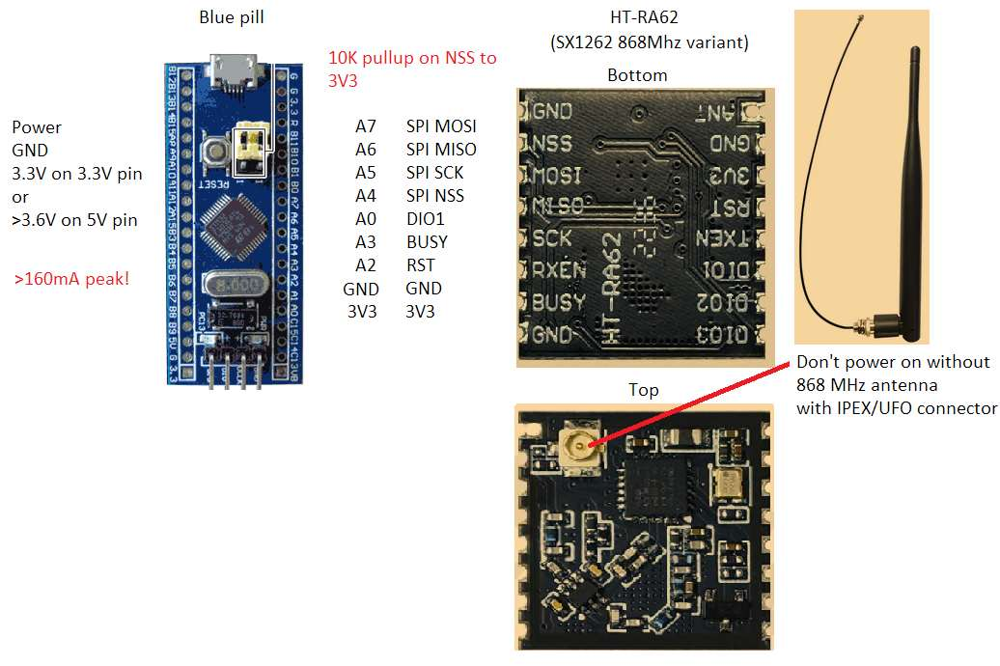
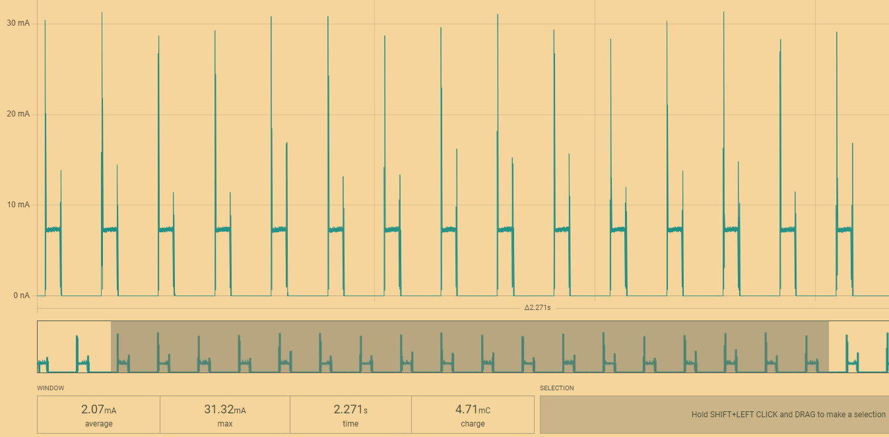
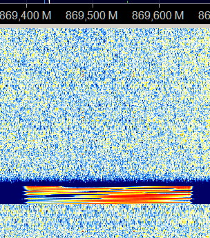
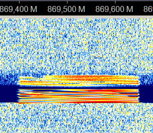

# MRN1 - Meshtastic Repeater Node
### Overview

### Why
* Purpose built repeater for low power consumption, with minimal component count, mass deployable

### Application
* Hardcoded EU868 LONG_FAST channel (869 525 024 Hz)
* With highest 22dBm TX power
* Receives Meshtastic packages with lowest possible receiving current using duty cycling, see plot below
  * At the cost of <1..5% messages not being detected, everything is a compromise
* It doesn't decode the payload only looks at routing header
* If msg filtering passes and decreased hopCounter is still >0 then it transmits it instantly
* Green LED comes on when Radio has to be rebooted, normally LED should be always off
* Use any programmer to burn in hex

### Parts from Ali
* [Blue pill STM32F103C8 not C6 variant](https://s.click.aliexpress.com/e/_EuSvBur)
* [ST-link or J-link to program it once](https://s.click.aliexpress.com/e/_ms8Cb48)
* [Heltec HT-RA62 or any SX1262 modules with required pins](https://s.click.aliexpress.com/e/_EG0nw3h)
* [pull up resistor for NSS](https://s.click.aliexpress.com/e/_EzU2Ik7)
* [868 Mhz antenna with IPEX connector, don't power on without it!](https://s.click.aliexpress.com/e/_EH5PcWR)

### Filtering drops messages with
* viaMQTT == 1
* srcAddr == 0 OR full FF
* srcAddr == destAddr
* destAddr == 0
* msgId == 0 OR full FF

### Warnings
* no TX rate limits
* don't power it on without antenna

### For lowest power
* Remove PWR LED resistor from Blue pill
* Remove 5pin regulator IC from Blue pill
  * and supply 3.3V via external DC/DC converter

### Current profile after these changes
* Can calculate with ~2.5mA constant battery drain, not including transmissions (~140mA)
* PV cell should provide min 4mA charging during cloudy overcast
* MLCC caps can reduce spikes but bottleneck is the TX which can last 2.2s

### Waterflow without repeater

### Waterflow with repeater

